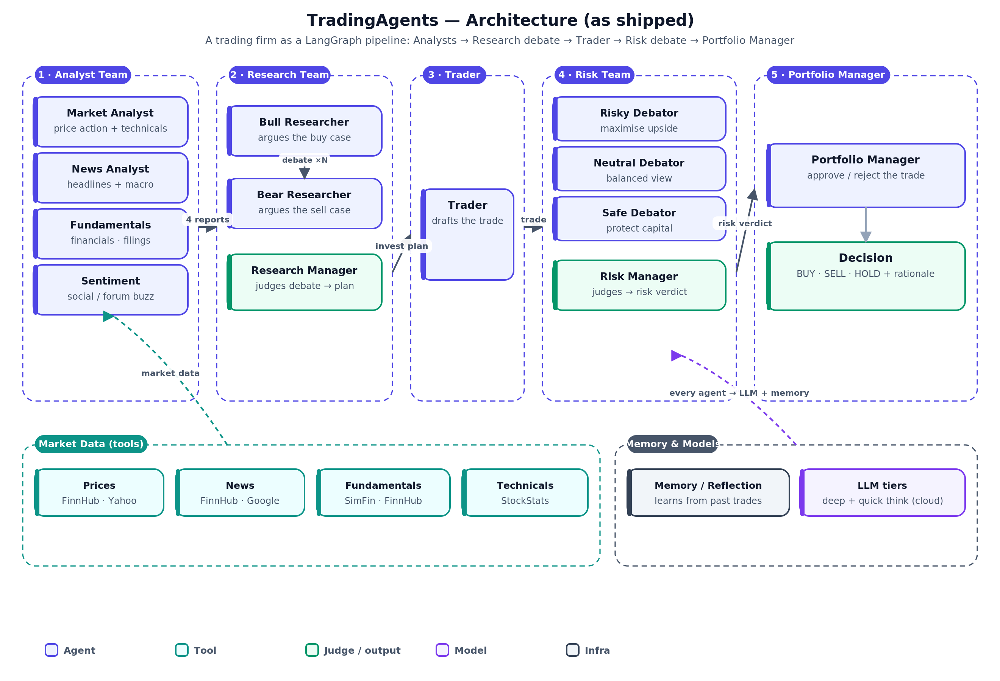
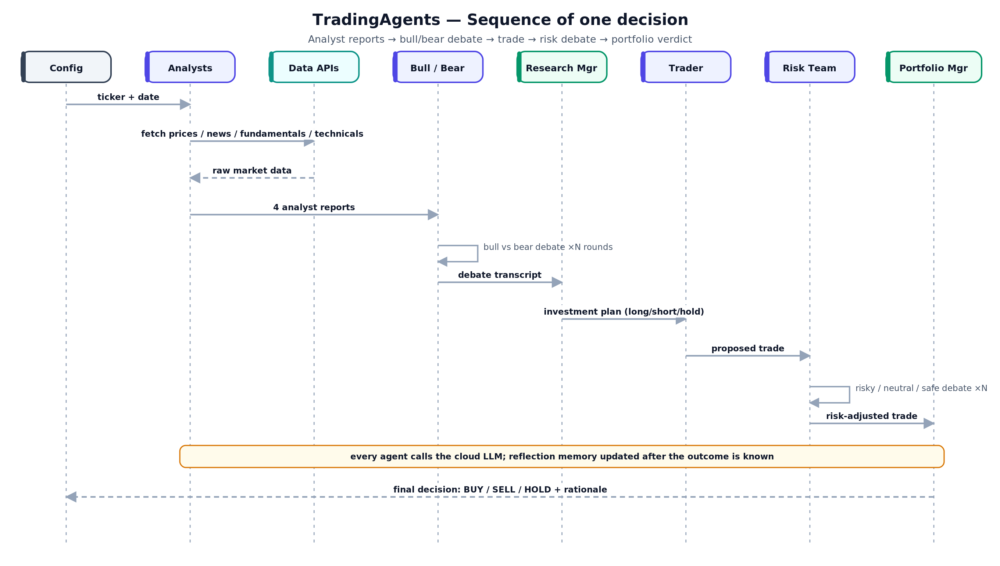
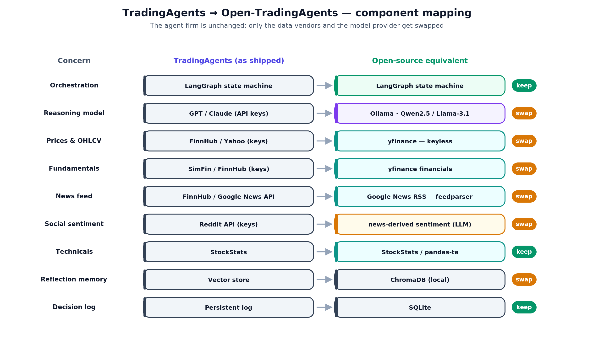
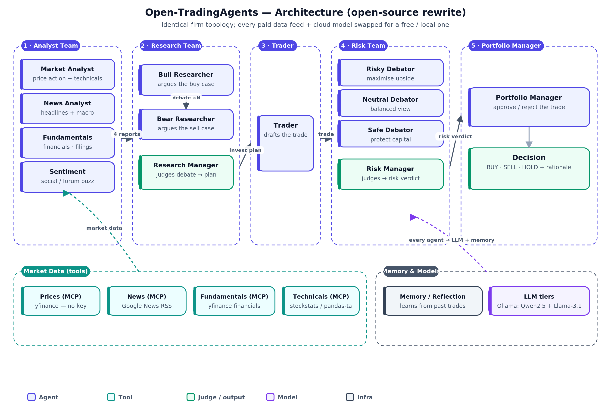
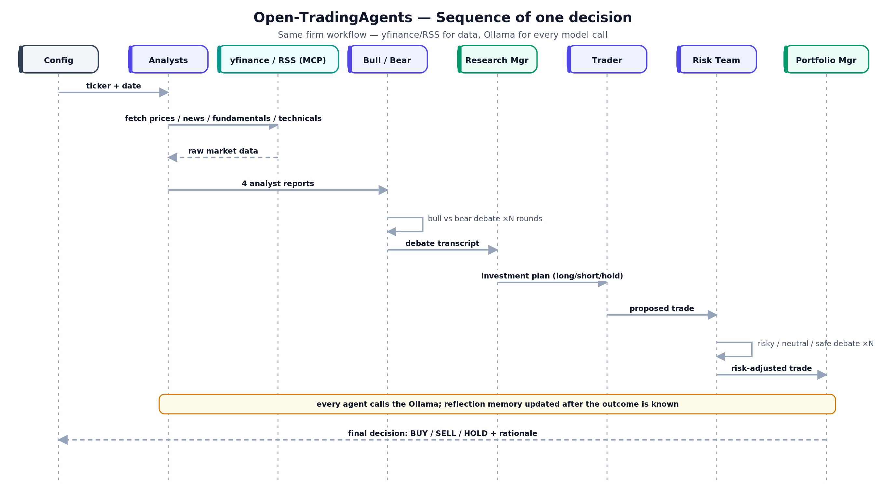

# TradingAgents, rebuilt in the open

### How a multi-agent "trading firm" works — and how to run one with no API keys

> Part of a series that takes a trending AI repository (spotted by
> [Gittyboy](https://github.com/batlabx/gittyboy)) and does two things: explain the design *only through
> pictures and code*, then rebuild it as a fully open-source stack. This one is about
> **[TauricResearch/TradingAgents](https://github.com/TauricResearch/TradingAgents)** ([arXiv 2412.20138](https://arxiv.org/abs/2412.20138)) — a multi-agent LLM
> framework that mirrors a real trading firm. The working rewrite is in [`src/`](src/open_tradingagents).

> ⚠️ **Educational / research only — not investment advice.** This article and the accompanying code
> exist to explain a *multi-agent software pattern*. The system's "BUY/SELL/HOLD" output is an
> illustration of agent reasoning, **not** a recommendation to trade any security. Nothing here is
> financial advice; do not use it to make real trading decisions.

---

## 1. The problem it solves

Ask a single LLM "should I buy NVDA?" and you get one model's overconfident guess in one voice. That is exactly how *not* to make a decision under uncertainty, and it's how most "LLM-for-trading" repos work: a prompt wrapper around a price feed.

Real trading desks are deliberately adversarial. They split the work across people who are *supposed* to disagree: analysts who each own one lens (fundamentals, technicals, news, sentiment), researchers who argue the bull case against the bear case, a trader who commits to a position, and risk managers who can veto it. The decision is the *output of structured disagreement*, and it comes with a paper trail explaining itself.

TradingAgents reproduces that firm as a **LangGraph multi-agent pipeline**. Instead of one prompt's confidence, you get a debate: a bull and a bear argue over the analysts' evidence, a research manager rules, a trader proposes, three risk personas fight over sizing, and a portfolio manager makes the final call. Every step is logged, so the decision explains its own reasoning.

### Practical use cases

| You want to… | TradingAgents gives you… |
|---|---|
| **Study how model choice changes decisions** | swap the LLM (GPT, Claude, Qwen, Llama…) and re-run the same firm on the same ticker to compare |
| **Backtest a *reasoning process*, not just a signal** | reproducible, logged multi-agent decisions on historical dates you can audit step by step |
| **Get an explained call instead of a black box** | a bull/bear + risk debate transcript behind every BUY/SELL/HOLD, so you can see *why* |
| **Learn a real, non-trivial LangGraph app** | a working example of nested debate loops, dynamic routing, and reflection memory |
| **Prototype an analyst assistant** | point the analyst agents at a ticker and get four sourced, single-lens briefs in one run |

The point is not to predict prices. It's to make the *reasoning* explicit, debatable, and inspectable — the opposite of a one-prompt oracle.

---

## 2. How it works, in pictures

The one-sentence description is a five-stage assembly line: **Analyst Team → Research debate → Trader → Risk debate → Portfolio Manager.** Data flows in at the left; a decision (with its rationale) comes out at the right.

### Architecture



Three things to read off it:

1. **It's a firm, not a prompt.** Thirteen agents in five stages, each with a narrow job. The "intelligence" is in the *structure* — specialization plus adversarial debate — as much as in any single model call.
2. **Judges gate every stage.** The green boxes (Research Manager, Risk Manager, Portfolio Manager) are decision points that consume a debate and emit a ruling. That is what turns argument into a decision.
3. **Data is a separate layer.** The analysts are the only agents that touch the outside world, and only through tools. Everything downstream reasons over their reports plus a reflection memory of past outcomes.

### The agents, tools, and skills

| Kind | Name | Responsibility |
|---|---|---|
| 🟦 Agent | **Market / News / Fundamentals / Sentiment analysts** | Each produces one single-lens, sourced report |
| 🟦 Agent | **Bull & Bear researchers** | Argue long vs short over N rounds |
| 🟩 Judge | **Research Manager** | Rules the debate → investment plan |
| 🟦 Agent | **Trader** | Turns the plan into a concrete proposal |
| 🟦 Agent | **Risky / Neutral / Safe debators** | Fight over position sizing |
| 🟩 Judge | **Risk Manager** | Rules → risk-adjusted trade |
| 🟩 Judge | **Portfolio Manager** | Final approve/reject → BUY / SELL / HOLD |
| 🟩 Tool | **get_prices / get_fundamentals / get_news / get_technicals** | Market-data capabilities the analysts call |
| 🟧 Skill | **Debate & report playbooks** | How to argue; how to format the final call |
| ⬛ Infra | **Reflection memory** | Lessons from past decisions, recalled by the judge |

### Sequence of a single decision



Notice the two self-loops: the bull/bear debate and the risk debate each cycle for several rounds before their judge steps in. That looping-then-judging shape is the core mechanic, and §4's code shows it's just a counter and a `goto`.

---

## 3. How to build an open-source version

As with most LangGraph projects, the framework is *already* open. What ties TradingAgents to paid infrastructure is two things: the **cloud LLM** (GPT/Claude keys) and the **market-data vendors** (FinnHub, SimFin, Reddit — all keyed). Swap those and the firm runs on a laptop.



The rewiring, concretely:

- **GPT/Claude → Ollama.** Two tiers (`deep_think` for debates, `quick_think` for analyst tool-use) both point at local models.
- **FinnHub/SimFin → yfinance.** Keyless prices *and* fundamentals from one library.
- **Google News API → Google News RSS.** The public RSS feed + `feedparser` needs no key or quota.
- **Reddit API → news-derived sentiment.** Rather than scrape a keyed social API, the sentiment analyst infers mood from the tone and volume of news coverage. (Add a Reddit tool later if you want; it's just another MCP server.)
- **StockStats stays** — it was already open — and gets a `pandas-ta` alias.

Everything else — LangGraph, the debate structure, the reflection memory, MCP — is unchanged.

### The open-source architecture

Same firm, free substrate. The five stages and thirteen agents are identical; only the data layer and model tier changed:





---

## 4. The code, line by line

Full package in [`src/open_tradingagents`](src/open_tradingagents). (`agents/` = graph nodes, `tools/` = MCP data servers, `skills/` = Markdown playbooks.) Here are the load-bearing pieces.

### 4.1 State — carrying two debates

The two nested debate records hold running transcripts and a round counter, which is all the looping machinery needs.

```python
# src/open_tradingagents/state.py
class InvestDebate(TypedDict):
    bull_history: str      # everything the bull has argued
    bear_history: str      # everything the bear has argued
    rounds: int            # completed bull+bear exchanges
    judge_decision: str    # the research manager's ruling

class TradingState(TypedDict):
    ticker: str
    trade_date: str
    reports: dict                       # one entry per analyst
    invest_debate: InvestDebate
    investment_plan: str
    trader_proposal: str
    risk_debate: RiskDebate
    final_decision: str
    messages: Annotated[list, add_messages]
```

### 4.2 A tool — `get_prices` as an MCP server

The keyless replacement for FinnHub, behind a typed contract. Standalone MCP, so Claude Desktop or Cursor can use it too.

```python
# src/open_tradingagents/tools/prices_server.py
mcp = FastMCP("open-tradingagents-prices")

@mcp.tool()
def get_prices(ticker: str, lookback_days: int = 180) -> dict:
    """Return a compact price summary for `ticker` over the lookback window."""
    hist = yf.Ticker(ticker).history(period=f"{lookback_days}d")
    if hist.empty:
        return {"ticker": ticker, "error": "no data"}
    close = hist["Close"]
    last, first = float(close.iloc[-1]), float(close.iloc[0])
    return {
        "ticker": ticker,
        "last_close": round(last, 2),
        "pct_change_window": round((last / first - 1) * 100, 2),
        "period_high": round(float(hist["High"].max()), 2),
        "period_low": round(float(hist["Low"].min()), 2),
        "last_5_closes": [round(float(x), 2) for x in close.tail(5)],
    }
```

### 4.3 An agent — one analyst, reused four times

A "specialist" is just a prompt + a tool loadout. The factory builds all four analysts; only the arguments differ.

```python
# src/open_tradingagents/agents/analysts.py
def make_analyst(name: str, tools):
    agent = create_react_agent(
        get_llm("quick_think"), tools=tools,
        prompt="You are a rigorous financial analyst. Call the tools you are "
               "given, cite concrete numbers, and end with a one-line bias.")

    def node(state):
        task = ANALYST_PROMPTS[name].format(
            ticker=state["ticker"], date=state["trade_date"])
        report = agent.invoke({"messages": [("user", task)]})["messages"][-1].content
        reports = dict(state.get("reports") or {})
        reports[name] = report
        return {"reports": reports}          # static edge -> next analyst
    return node
```

…and in the graph, the same factory yields four specialists by changing the tools:

```python
# src/open_tradingagents/graph.py  (excerpt)
g.add_node("market_analyst",       make_analyst("market",       [by["get_prices"], by["get_technicals"]]))
g.add_node("news_analyst",         make_analyst("news",         [by["get_news"]]))
g.add_node("fundamentals_analyst", make_analyst("fundamentals", [by["get_fundamentals"]]))
g.add_node("sentiment_analyst",    make_analyst("sentiment",    [by["get_news"]]))
```

### 4.4 The debate — a loop is just a counter and a `goto`

This is the whole "multi-agent debate" mechanism. The bear increments the round counter and either loops back to the bull or routes to the judge. No framework magic.

```python
# src/open_tradingagents/agents/researchers.py
def bear_researcher(state) -> Command:
    d = state["invest_debate"]
    text = get_llm("deep_think").invoke(
        BEAR_PROMPT.format(ticker=state["ticker"], skill=load_skill("bull_bear_debate"),
                           reports=_reports(state), bull=d["bull_history"])).content
    rounds = d["rounds"] + 1
    d = {**d, "bear_history": d["bear_history"] + "\n[BEAR] " + text, "rounds": rounds}
    goto = "bull_researcher" if rounds < CONFIG.max_debate_rounds else "research_manager"
    return Command(goto=goto, update={"invest_debate": d})   # <- loop or judge
```

The judge then reads the whole transcript *plus lessons from memory* and rules:

```python
# src/open_tradingagents/agents/researchers.py
def research_manager(state) -> Command:
    d = state["invest_debate"]
    decision = get_llm("deep_think").invoke(
        RESEARCH_MANAGER_PROMPT.format(
            ticker=state["ticker"], bull=d["bull_history"], bear=d["bear_history"],
            memory=recall(state["ticker"]))).content        # reflection memory
    return Command(goto="trader",
                   update={"invest_debate": {**d, "judge_decision": decision},
                           "investment_plan": decision})
```

The risk team (`risky → safe → neutral → risk_manager`) is the *same* loop with different personas — proof that once you have the pattern, adding a "team" is prompts, not plumbing.

### 4.5 A skill — how the manager writes the call

The portfolio manager calls no tools. Its output *format* is a skill — Markdown, editable by an analyst, not an engineer.

```python
# src/open_tradingagents/agents/portfolio_manager.py
def portfolio_manager(state) -> Command:
    final = get_llm("deep_think").invoke(
        PORTFOLIO_MANAGER_PROMPT.format(
            ticker=state["ticker"], skill=load_skill("trade_report"),  # <- playbook
            risk_decision=state["risk_debate"]["judge_decision"],
            plan=state["investment_plan"])).content
    return Command(goto=END, update={"final_decision": final})
```

### Why is something a *tool* and not a *skill*?

The single most useful design distinction, and this repo is a clean split:

| | **Tool** (`get_prices`, `get_news`) | **Skill** (`bull_bear_debate.md`, `trade_report.md`) |
|---|---|---|
| Has an API boundary? | **Yes** — `ticker → typed data` | No — it's prose |
| Side effects? | **Yes** — network call to a data source | None |
| How the model uses it | The model **calls** it and reads the result | The model **reads** it to shape its reasoning |
| Who owns it | An engineer (it's code) | A trader / analyst (it's Markdown) |
| Where it lives | Behind **MCP**, reusable by any client | A file the agent loads at runtime |

Rule of thumb: **if it fetches or computes a verifiable value, it's a tool — put it behind MCP. If it's judgment about *how to reason*, it's a skill — keep it as editable text.** "Get AAPL's RSI" is a tool (there's a right answer). "How a bull should argue" is a skill (there's only better or worse). Notice the reflection *memory* is neither — it's infrastructure the graph reads around the agents, so it lives outside both `tools/` and `skills/`.

---

## Run it yourself

```bash
pip install -e .                        # install the package
ollama pull qwen2.5:14b-instruct        # the deep-think model
python -m open_tradingagents.main NVDA --date 2026-01-15
```

It streams each stage — analysts, debate, trader, risk debate — and prints the final, self-explaining call. Everything runs locally with no API keys.

---

> ⚠️ **Educational / research only — not investment advice.** The output is an illustration of a
> multi-agent reasoning process, not a recommendation. Markets involve risk; consult a licensed
> professional before making any investment decision.
>
> *Architecture reflects TradingAgents' documented design (analysts → bull/bear research → trader →
> risk debate → portfolio manager; arXiv 2412.20138). Momentum figures in the source Gittyboy brief
> are auto-generated and not independently verified. This repo is a compact educational
> reimplementation, not the original source.*
